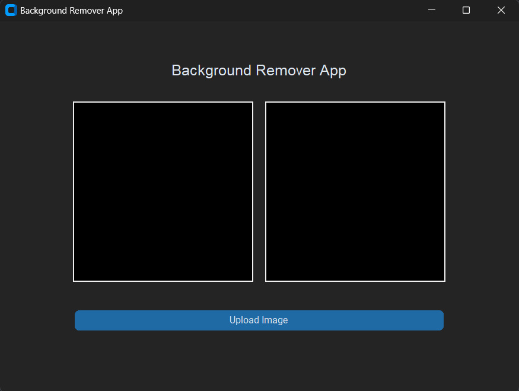
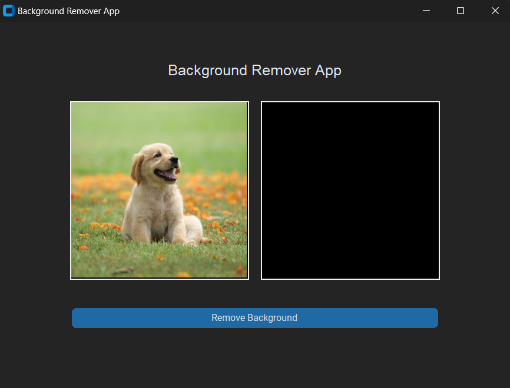
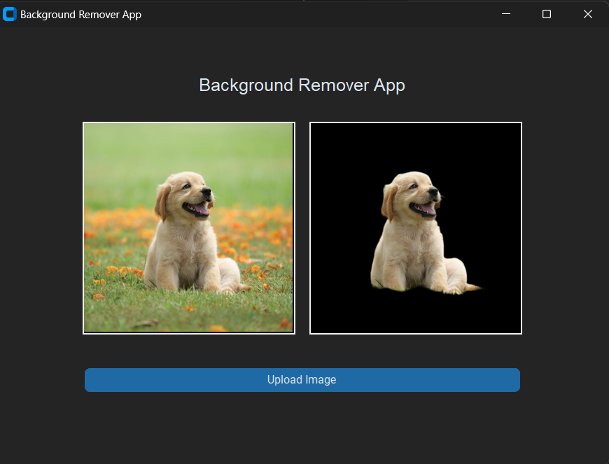

# Background Remover App

Welcome to the Background Remover App! This repository contains the source code for a simple application that removes backgrounds from images.

## Overview

The Background Remover App utilizes a rembg library to remove backgrounds from images, leaving only the foreground objects.

## Features

- **Image Upload**: Users can upload images from their local device.
- **Background Removal**: The app removes the background from uploaded images.
- **Download**: Edited images are automatically downloaded in a PNG format

## Implementation

### Tkinter Window

### Uploaded Image Preview

### Background Removed Image Preview

## Installation/ Depoloyment

To use the Remover App, simply clone the repository and install the required modules seen in requirements.txt
